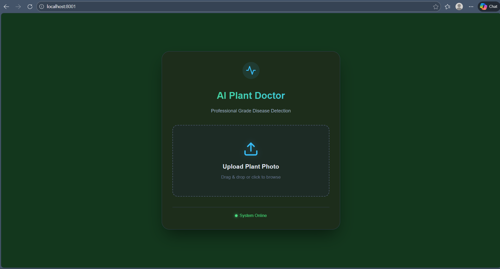
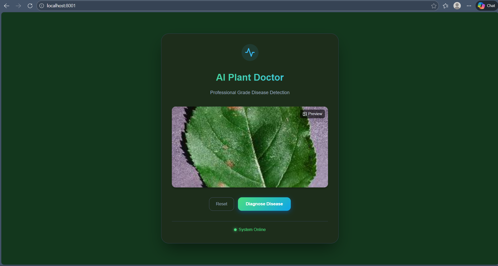
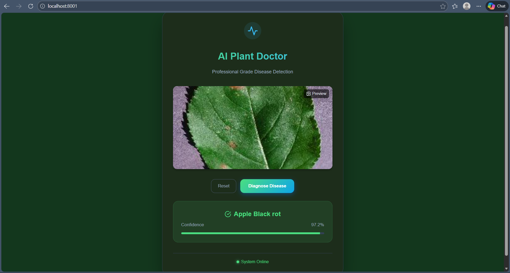

# AI Plant Doctor

AI Plant Doctor is a progressive web application that uses Deep Learning to detect diseases in plants instantly. By simply uploading a photo of a leaf, the AI analyzes the image entirely in the browser (Client-Side) to diagnose issues like Blight, Rot, or Rust.



## Features

Real-time Diagnosis: Detects 38 different plant diseases.

Privacy First: All analysis happens in the browser using TensorFlow.js. No images are sent to a server.

MobileNetV3 Architecture: Lightweight and fast, optimized for web and mobile devices.

Offline Capable: Once loaded, the app works without an internet connection.

## Tech Stack

**Frontend:** React, Vite

**AI/ML:** TensorFlow.js, Keras (MobileNetV3)

**Styling:** CSS Modules, Lucide React Icons

**Deployment:** Docker, Nginx (or Vercel)

## Architecture

**Training:** The model was trained on the PlantVillage dataset (50,000+ images) using Python & Keras on a Tesla T4 GPU.

**Conversion:** The Keras model (.h5) was converted to a TensorFlow.js Graph Model (model.json).

**Inference:** The React app loads this graph model and runs prediction on the client's GPU via WebGL.

## How to Run Locally
```
Prerequisites

Node.js (v18+)

Docker (Optional, for containerized run)
```
### Option 1: Quick Start (Node.js)

### 1. Clone the repository
```
git clone [https://github.com/YOUR_USERNAME/ai-plant-doctor.git](https://github.com/YOUR_USERNAME/ai-plant-doctor.git)

cd ai-plant-doctor/webapp
```

### 2. Install dependencies
```
npm install
```

### 3. Start the dev server
```
npm run dev


Open http://localhost:5173 to view it in the browser.
```

### Option 2: Production Container (Docker)

```
# From the root directory
docker compose up --build


Open http://localhost to view the production build.
```

## Model Performance

The model achieves ~96% accuracy on the validation set across 38 classes, including:

Apple (Scab, Black Rot, Rust)

Corn (Leaf Spot, Blight)

Potato (Early/Late Blight)

Tomato (Bacterial Spot, Leaf Mold, Mosaic Virus)

## License

This project is open-source and available under the MIT License.